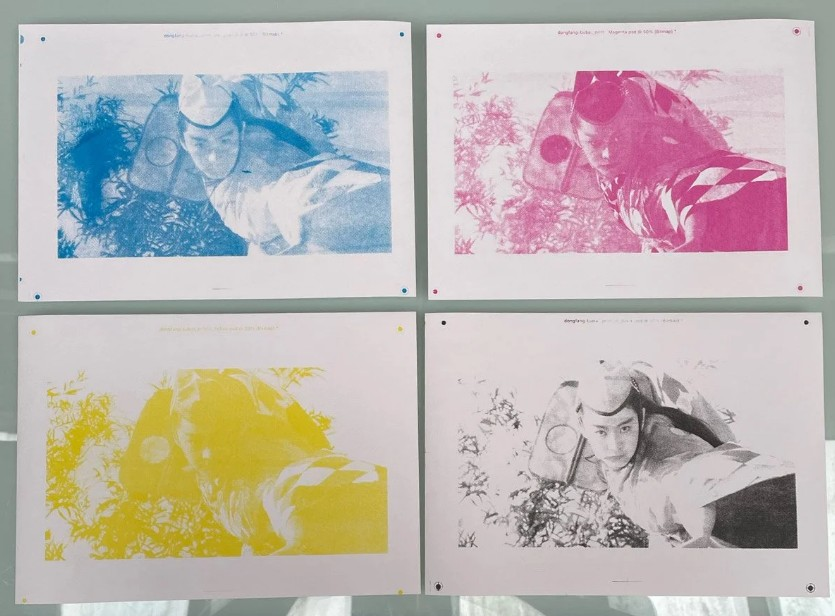
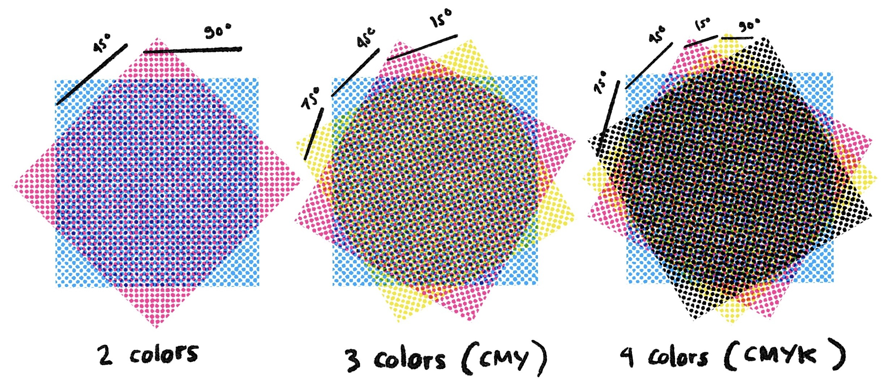
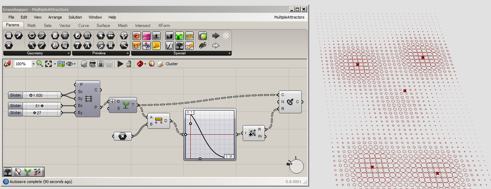
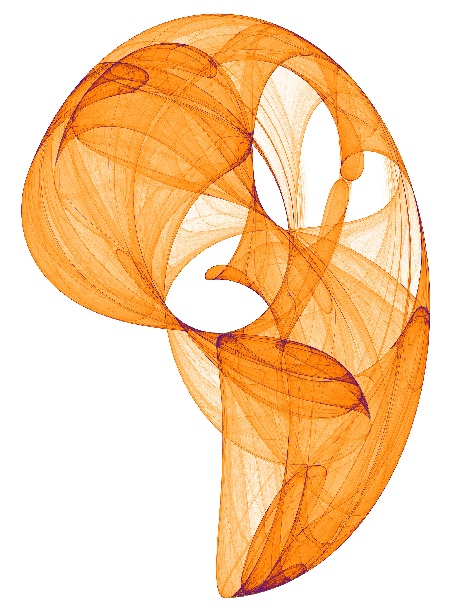
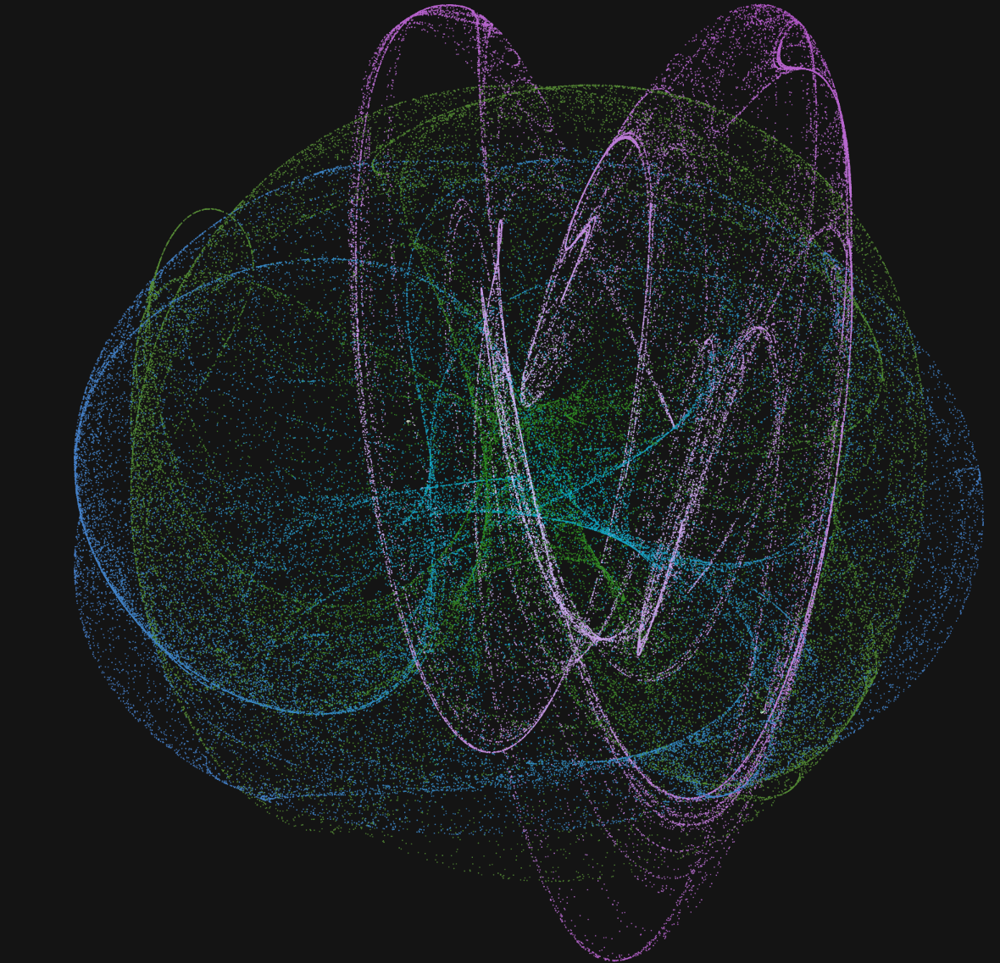

# lkle7577_9103_tut8

## Part 01: Imaging Technique Inspiration

I was inspired by the technique of **CMYK screenprinting**. This is a technique that consists of layering semi transparent inks in Cyan, Magenta, Yellow & Black, to create photorealistic colour images. Four different screens are used for each colour channel represented. 

This is an interesting technique, as it is an additive colour process, allowing for separate colour channels to be overlayed / manipulated - maybe even with user input. There are also many examples online of CMYK colour printing of small dots printed in varying angles being used to create different effects, as seen in the example image 02 below. 

> this can be seen in the following images:

*Fig. 01 - An image of CMYK screenprinting*

*Fig. 02 - An image of the use of angled dots in CMYK screenprinting*

## Part 02: Coding Technique Exploration

When looking at dot placement, I was inspired to look at some options for the use of attractor points in coding. 

I have experience using attractor points in the realms of grasshopper coding (within more architectural parameters, within the Rhino3D ecosystem), and I think they are a really interesting and dynamic way of creating parametric design. 

*Fig. 03 - Attractor points example in grasshopper*

I found a variety of this kind of logic in the **Clifford Attractor**, a 2D strange attractor generated by an iterative system of equations that define a particle's path through a plane. It uses sine and cosine functions with four adjustable parameters to create fractal-like patterns as the particle's path evolves. The final image is essentially a density map of the points visited by the particle, where the varied shapes of the attractor are determined by the choice of parameters.  

*Fig. 04 - Clifford Attractor example*

An example of this within p5.js can be found by clicking this [link](https://editor.p5js.org/is2431/sketches/jnftIZyOX)

*Fig. 05 - Screenshot of example code above*